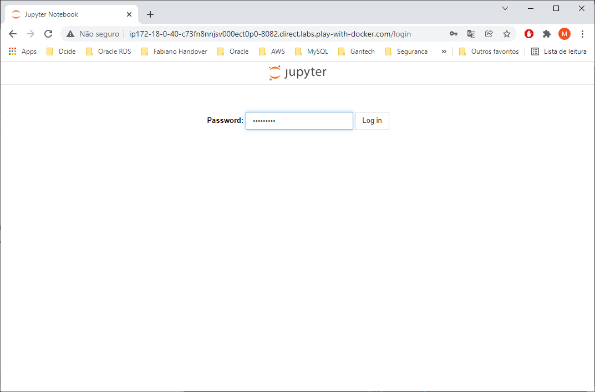
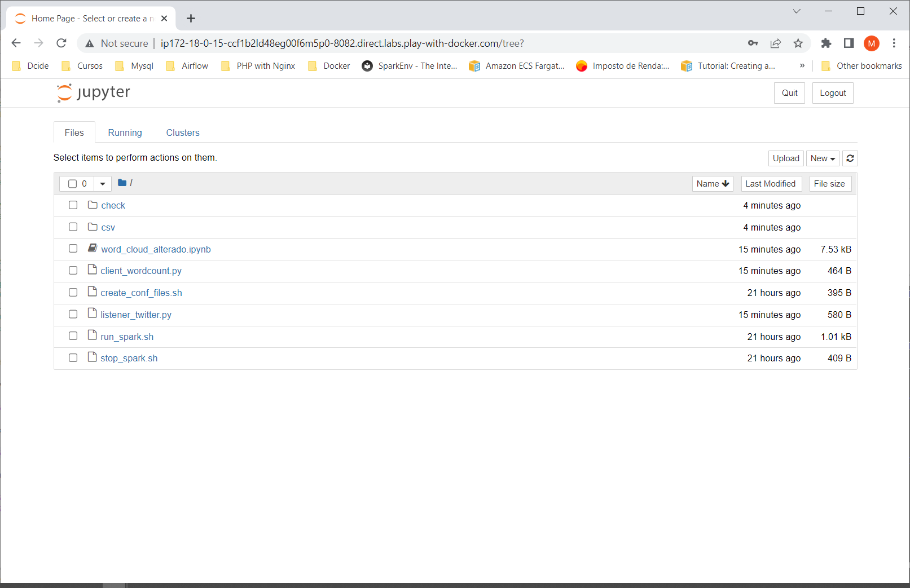
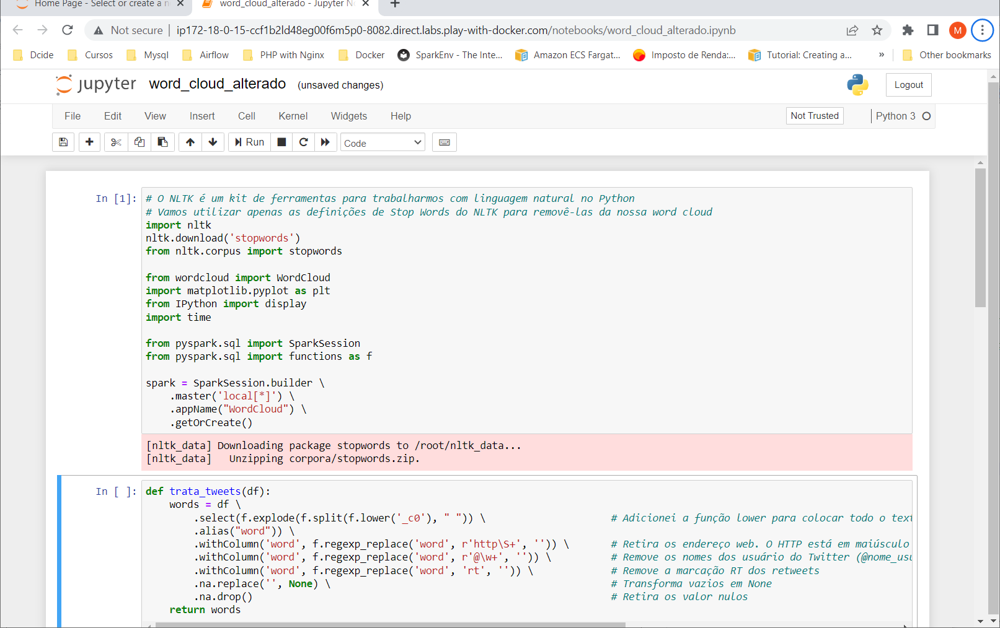

# Jupyter client running into Standalone cluster in Docker

Apache Spark is an open-source, distributed processing system used for big data workloads.

In this demo, a Spark container uses a Spark Standalone cluster as a resource management and job scheduling technology to perform distributed data processing.

This Docker image contains Spark binaries prebuilt and uploaded in Docker Hub.

## Build Jupyter Spark image
```shell
$ docker image build -t mkenjis/ubpyspk1_img
$ docker login   # provide user and password
$ docker image push mkenjis/ubpyspk1_img
```

## Start Swarm cluster

1. start swarm mode in node1
```shell
$ docker swarm init --advertise-addr <IP node1>
$ docker swarm join-token manager  # issue a token to add a node as manager to swarm
```

2. add more managers in swarm cluster (node2, node3, ...)
```shell
$ docker swarm join --token <token> <IP nodeN>:2377
```

3. start a spark standalone cluster and spark client
```shell
$ docker stack deploy -c docker-compose.yml spk
$ docker service ls
ID             NAME           MODE         REPLICAS   IMAGE                             PORTS
t3s7ud9u21hr   spk_spk_mst    replicated   1/1        mkenjis/ubpyspk1_img:latest   
mi3w7xvf9vyt   spk_spk1   replicated   1/1        mkenjis/ubpyspk1_img:latest   
xlg5ww9q0v6j   spk_spk2   replicated   1/1        mkenjis/ubpyspk1_img:latest   
ni5xrb60u71i   spk_spk3   replicated   1/1        mkenjis/ubpyspk1_img:latest
```

4. access spark master node
```shell
$ docker container ls   # run it in each node and check which <container ID> is running the Spark master constainer
CONTAINER ID   IMAGE                         COMMAND                  CREATED              STATUS              PORTS      NAMES
71717fcd5a01   mkenjis/ubpyspk1_img:latest   "/usr/bin/supervisord"   14 minutes ago   Up 14 minutes   4040/tcp, 7077/tcp, 8080-8082/tcp, 10000/tcp   spark_spk2.1.bf8tsqv5lyfa4h5i8utwvtpch
464730a41833   mkenjis/ubpyspk1_img:latest   "/usr/bin/supervisord"   14 minutes ago   Up 14 minutes   4040/tcp, 7077/tcp, 8080-8082/tcp, 10000/tcp   spark_spk_mst.1.n01a49esutmbgv5uum3tdsm6p

$ docker container exec -it <spk_mst ID> bash
```

5. run jupyter notebook --generate-config
```shell
$ jupyter notebook --generate-config
```

6. edit /root/.jupyter/jupyter_notebook_config.py
```shell
$ vi /root/.jupyter/jupyter_notebook_config.py
c.NotebookApp.ip = '*'
c.NotebookApp.open_browser = False
c.NotebookApp.port = 8082
```

7. setup a jupyter password
```shell
$ jupyter notebook password
Enter password:  *********
Verify password: *********
```

8. run pyspark
```shell
PYSPARK_DRIVER_PYTHON_OPTS="notebook --no-browser --allow-root --port=8082" pyspark --master spark://<hostname>:7077
```

9. edit and run listener_twitter.py
```shell
$ vi listener_twitter.py
token="<bearer_token>"   # provide your Twitter BEARER_TOKEN

$ python3 listener_twitter.py
Aguardando conexão na porta: 9009
```

10. run client_wordcount.py
```shell
$ PYSPARK_DRIVER_PYTHON=/usr/bin/python3.8
$ spark-submit client_wordcount.py
22/09/11 12:17:14 WARN NativeCodeLoader: Unable to load native-hadoop library for your platform... using builtin-java classes where applicable
22/09/11 12:17:20 WARN TextSocketSourceProvider: The socket source should not be used for production applications! It does not support recovery.
```

11. in the browser, issue the address https://host:8082 to access the Jupyter Notebook.

Provide the credentials previously created



Click on word_cloud_alterado.ipynb to start the notebook.



Issue Spark commands



